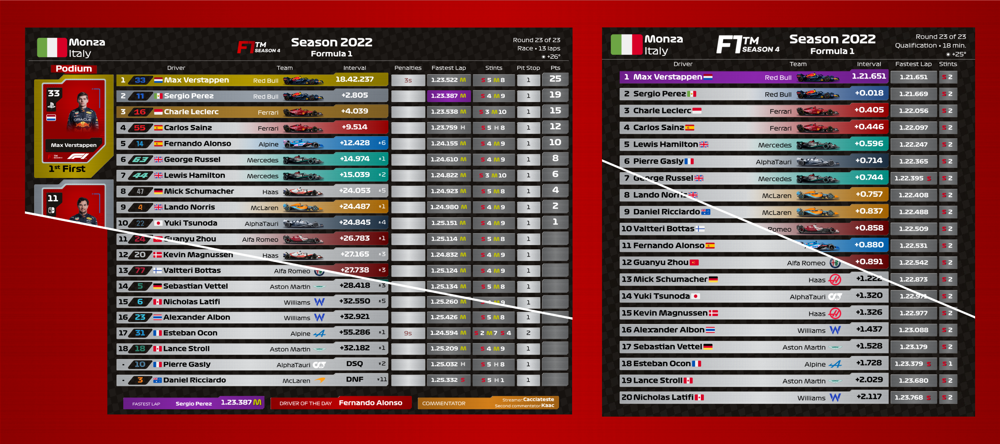
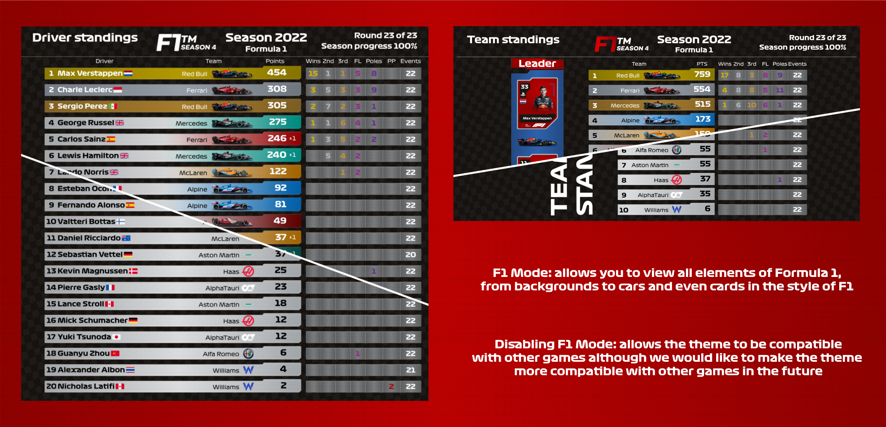
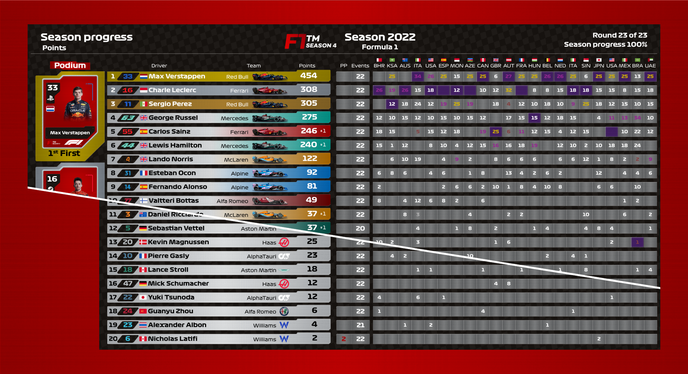
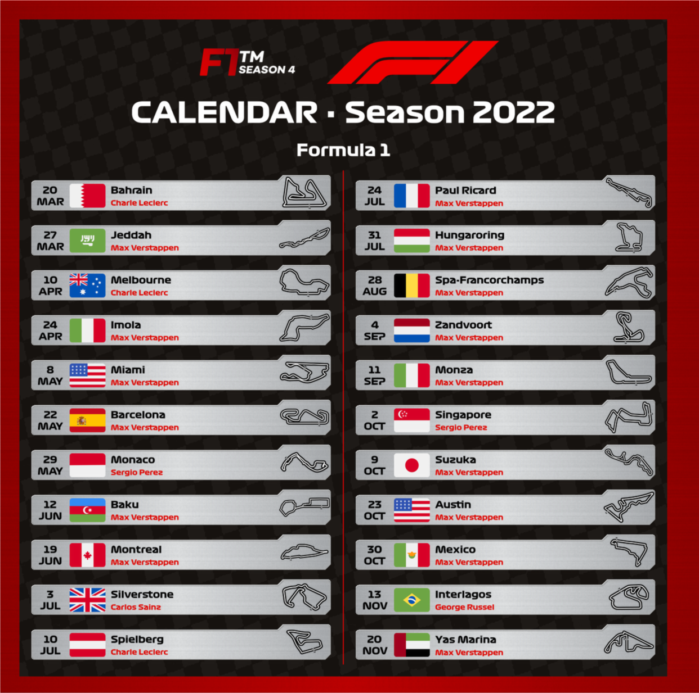
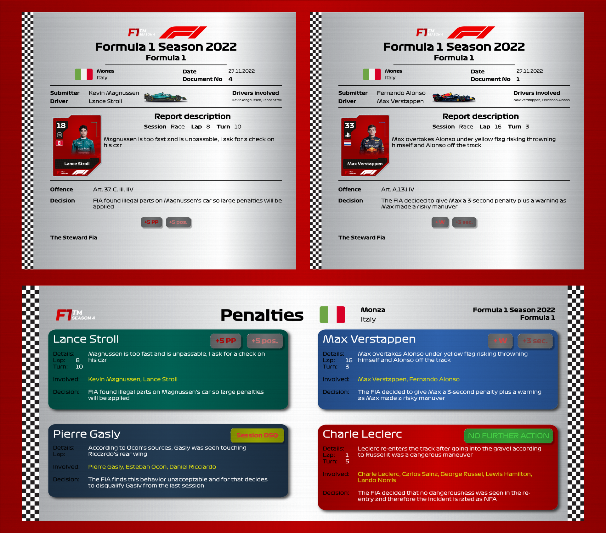
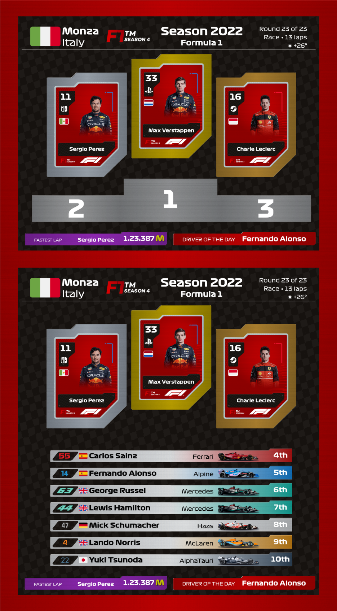
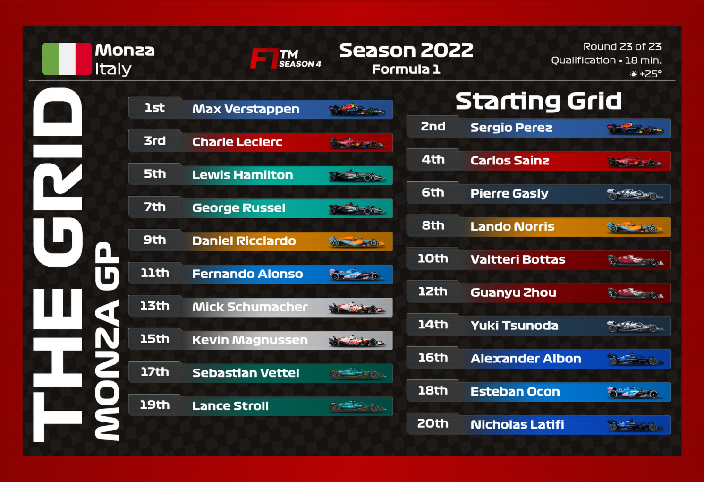
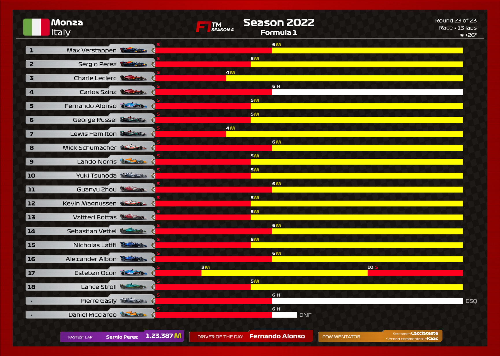
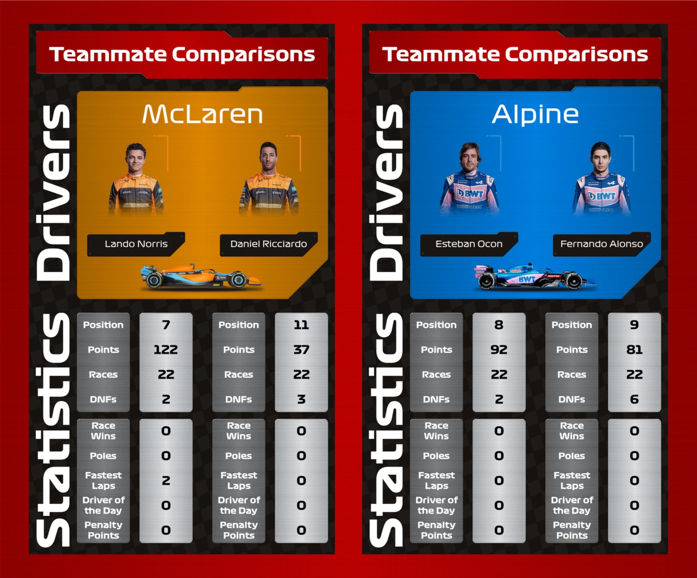
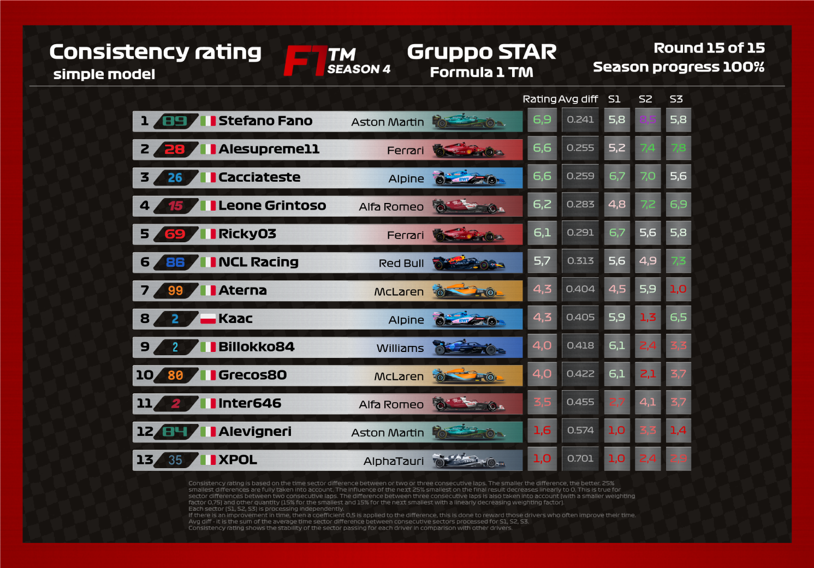

# Titanium Plates Theme for Racing League Tools

We are very excited to introduce you to the Racing League Tools theme by Caccia.

Initially, the theme was intended for the League's internal use, but the theme evolved and we decided to join forces. Caccia designed the theme, prepared all the elements, the only thing left for me to do is dress it in code.

## Purpose of the theme

We are aiming to ensure compatibility with all games the results of which can be stored in Racing League Tools. If our theme doesn't work properly with your game, please let us know

## Features and Update

- Special sticker for one or two streamers/commentators
- Unique renders: Stints, Podium/Top 10, The Grid, Team Comparisons, Single Penalties
- A unique visualization has been prepared especially for the F1 leagues, containing the colors of individual F1 teams and even their cars!
- Automatic card generation, and if F1 mode is activated there will be the faces of real F1 drivers
- An update will come to add F1 23 drivers and teams

## Available render layouts:

- Race Results and Qualification Results (with cards)

From the settings you can change some things like displaying race numbers and flags (cards can be turned on or off)

- Driver Standings and Team Standing (with cards)

- Line-up with Cards

Now from the settings you can choose to render line-ups vertically or horizontally

- Driver Standings - Progress Positions/Points (with cards)

- Calendar

For the calendar you have to set from the settings how many races each column has (the one shown here has 11 races on the first column since there are 22 races this season)

- Penalties (single and multi)

Thanks to Kaac you can choose to render each penalty individually and have an Official style Report or select all reports and render a summary of all penalties

- Podium and Top 10 (with cards)

If for you the classic render for the races is too complicated you can render only the podium or the top 10 so it remains easier to share and to read for everyone (Go to settings to change between Podio and Top 10 render)

- The Grid

If you want a simpler qualifying render, you can use this alternative to show the starting grid to everyone (in the settings change how many pilots participated in the qualification)

- Stints

This render allows you to see the stints of all the players in the Formula 1 style

- Team Comparisons (with cards)

As an additional render you can compare the drivers of the various teams (to change the displayed team just go to the settings)

- Statistics (sessions and season)

All RLT renders are included (some renders require access to the various "Advanced" and "Pro" additional features)

