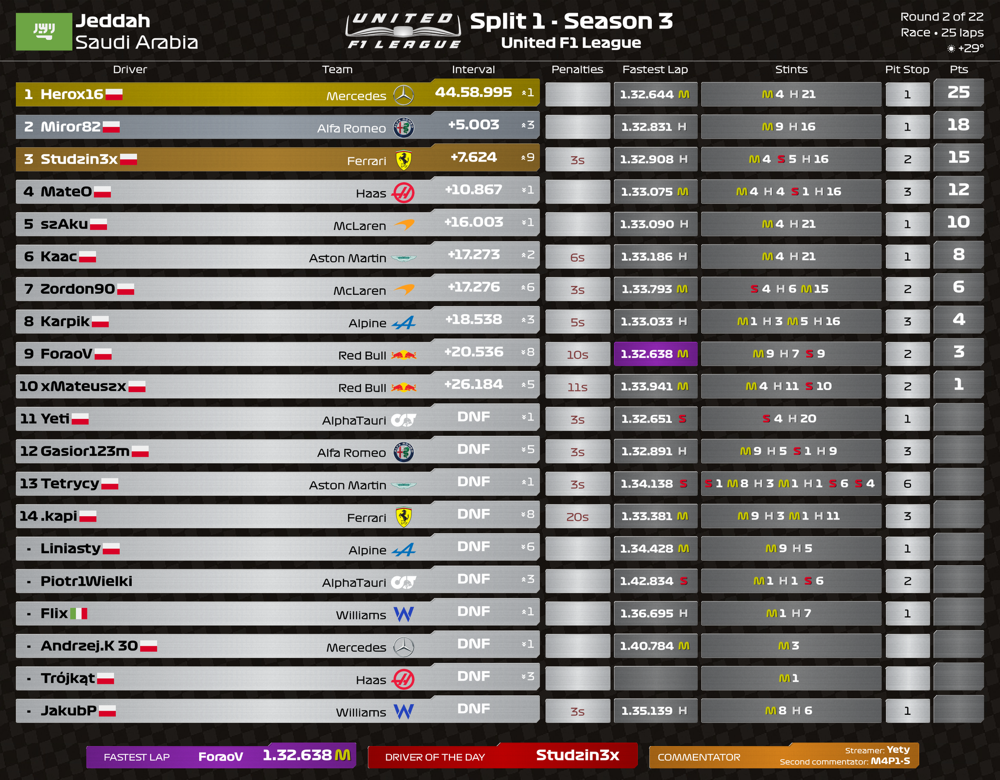
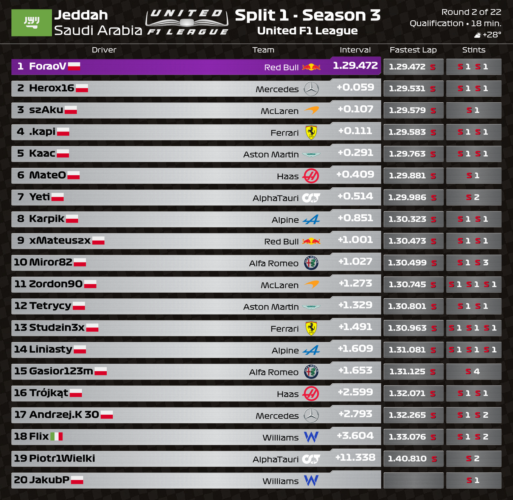
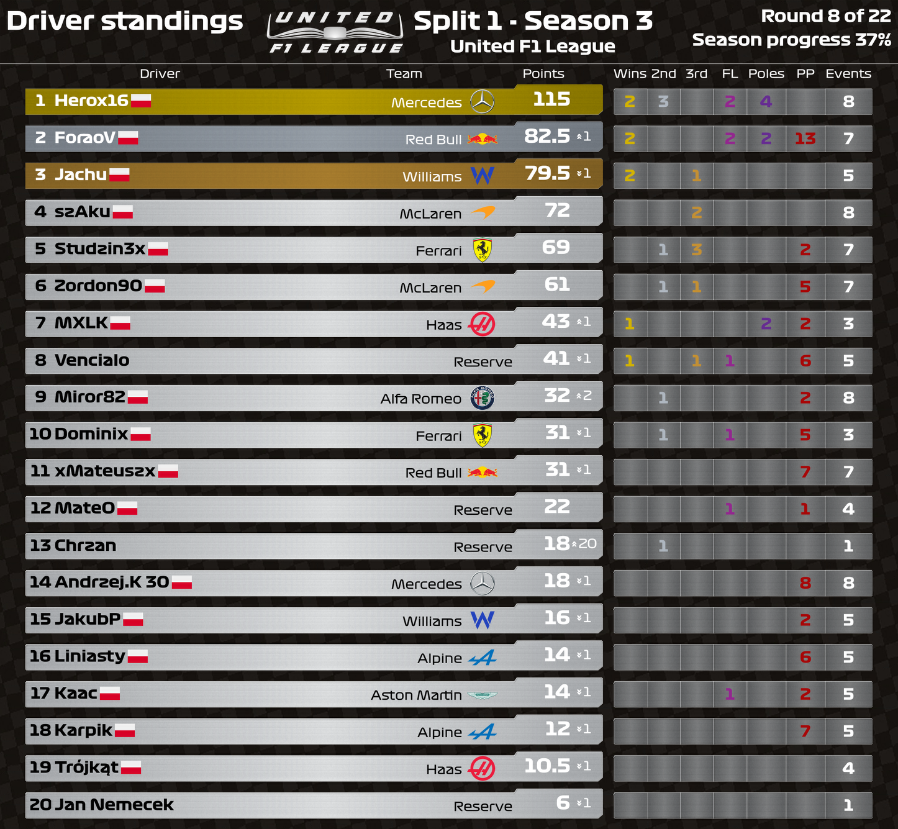
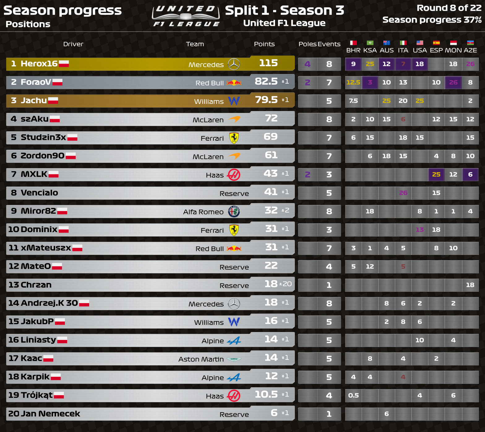
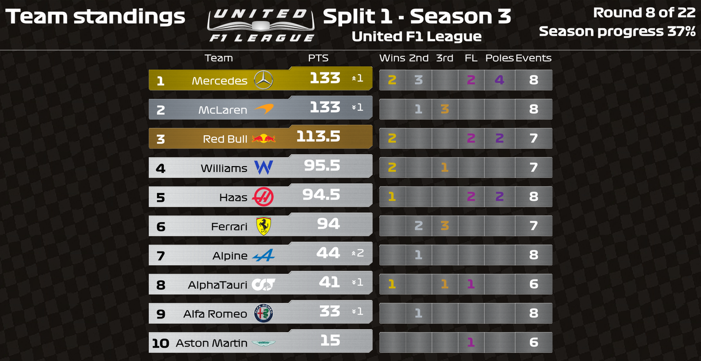

# Caccia's Theme for Racing League Tools

We are very excited to introduce you to the Racing League Tools theme by Caccia.

Initially, the theme was intended for the League's internal use, but the theme evolved and we decided to join forces. Caccia designed the theme, prepared all the elements, the only thing left for me to do is dress it in code.

## Purpose of the theme

We are aiming to ensure compatibility with all games the results of which can be stored in Racing League Tools. If our theme doesn't work properly with your game, please let us know

## Available render layouts:

- Race Results

- Qualification Results

- Driver Standings

- Driver Standings - Progress Positions

- Driver Standings - Progress Points

- Team Standings

## Features

- Special sticker for one or two streamers/commentators

## An extra feature for the F1 game

A unique visualization has been prepared especially for the F1 leagues, containing the colors of individual F1 teams and even their cars!

