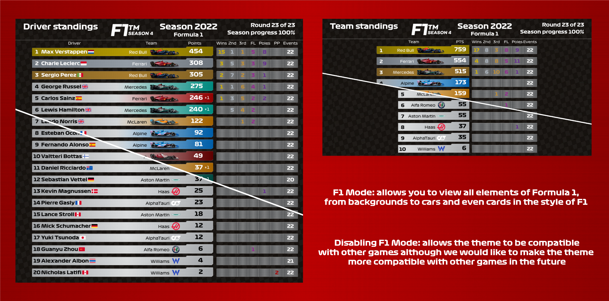
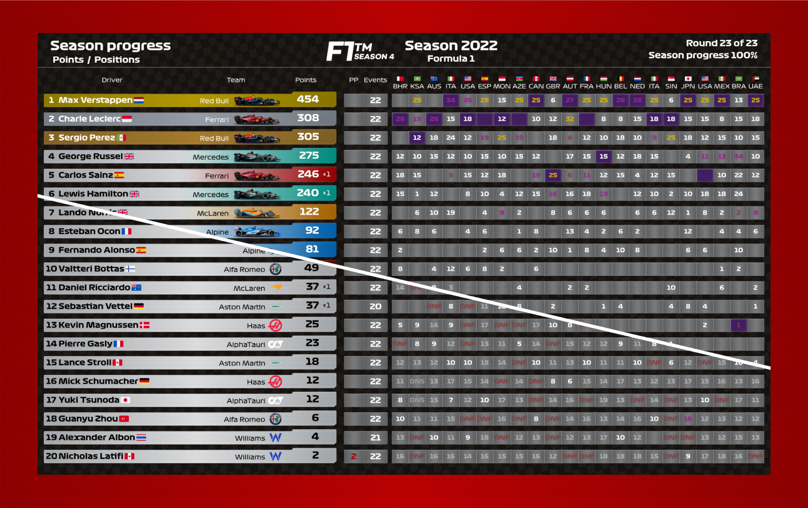

# Titanium Plates Theme for Racing League Tools

We are very excited to introduce you to the Racing League Tools theme by Caccia.

Initially, the theme was intended for the League's internal use, but the theme evolved and we decided to join forces. Caccia designed the theme, prepared all the elements, the only thing left for me to do is dress it in code.

## Purpose of the theme

We are aiming to ensure compatibility with all games the results of which can be stored in Racing League Tools. If our theme doesn't work properly with your game, please let us know

## Features and Update

- Special sticker for one or two streamers/commentators

- A unique visualization has been prepared especially for the F1 leagues, containing the colors of individual F1 teams and even their cars!
- Automatic card generation, and if F1 mode is activated there will be the faces of real F1 drivers
- A patch will come in the future to improve the use of cards in various renders

## Available render layouts:

- Race Results and Qualification Results

- Driver Standings and Team Standing

 Line-up with Cards

- Driver Standings - Progress Positions/Points

